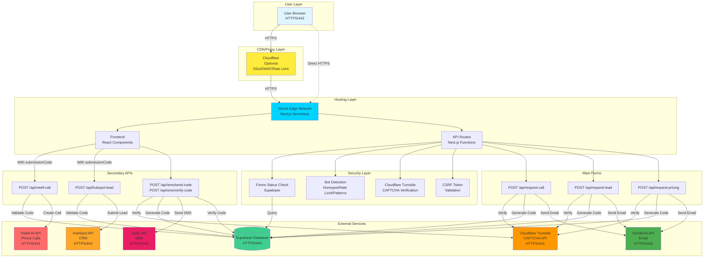
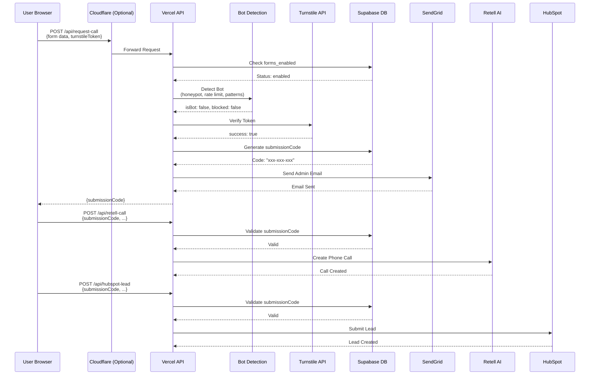
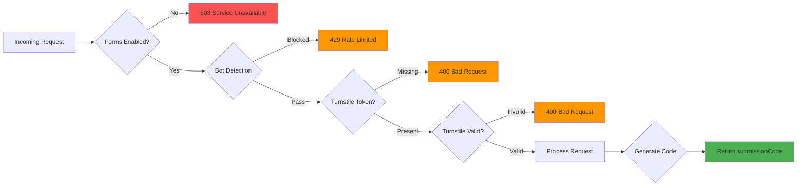

# Data Flow Diagram - coldi.ai (Mermaid)

```mermaid
graph TB
    subgraph "User Layer"
        Browser[User Browser<br/>HTTPS/443]
    end

    subgraph "CDN/Proxy Layer"
        CF[Cloudflare<br/>Optional<br/>DDoS/WAF/Rate Limit]
    end

    subgraph "Hosting Layer"
        Vercel[Vercel Edge Network<br/>Next.js Serverless]
        Frontend[Frontend<br/>React Components]
        API[API Routes<br/>Next.js Functions]
    end

    subgraph "Security Layer"
        BotDetect[Bot Detection<br/>Honeypot/Rate Limit/Patterns]
        Turnstile[Cloudflare Turnstile<br/>CAPTCHA Verification]
        CSRF[CSRF Token<br/>Validation]
        FormsStatus[Forms Status Check<br/>Supabase]
    end

    subgraph "Main Forms"
        CallForm[POST /api/request-call]
        LeadForm[POST /api/request-lead]
        PricingForm[POST /api/request-pricing]
    end

    subgraph "Secondary APIs"
        RetellAPI[POST /api/retell-call]
        HubSpotAPI[POST /api/hubspot-lead]
        SMS[POST /api/sms/send-code<br/>POST /api/sms/verify-code]
    end

    subgraph "External Services"
        Supabase[(Supabase Database<br/>HTTPS/443)]
        Retell[Retell AI API<br/>Phone Calls<br/>HTTPS/443]
        HubSpot[HubSpot API<br/>CRM<br/>HTTPS/443]
        Twilio[Twilio API<br/>SMS<br/>HTTPS/443]
        SendGrid[SendGrid API<br/>Email<br/>HTTPS/443]
        TurnstileAPI[Cloudflare Turnstile<br/>CAPTCHA API<br/>HTTPS/443]
    end

    Browser -->|HTTPS| CF
    CF -->|HTTPS| Vercel
    Browser -.->|Direct HTTPS| Vercel
    Vercel --> Frontend
    Vercel --> API

    API --> FormsStatus
    FormsStatus -->|Query| Supabase

    API --> BotDetect
    API --> Turnstile
    API --> CSRF

    API --> CallForm
    API --> LeadForm
    API --> PricingForm

    CallForm -->|Verify| TurnstileAPI
    LeadForm -->|Verify| TurnstileAPI
    PricingForm -->|Verify| TurnstileAPI

    CallForm -->|Generate Code| Supabase
    LeadForm -->|Generate Code| Supabase
    PricingForm -->|Generate Code| Supabase

    CallForm -->|Send Email| SendGrid
    LeadForm -->|Send Email| SendGrid
    PricingForm -->|Send Email| SendGrid

    Frontend -->|With submissionCode| RetellAPI
    Frontend -->|With submissionCode| HubSpotAPI

    RetellAPI -->|Validate Code| Supabase
    RetellAPI -->|Create Call| Retell

    HubSpotAPI -->|Validate Code| Supabase
    HubSpotAPI -->|Submit Lead| HubSpot

    Frontend --> SMS
    SMS -->|Verify| TurnstileAPI
    SMS -->|Generate Code| Supabase
    SMS -->|Send SMS| Twilio
    SMS -->|Verify Code| Supabase

    style Browser fill:#e1f5ff
    style CF fill:#ffeb3b
    style Vercel fill:#00d4ff
    style Supabase fill:#3ecf8e
    style Retell fill:#ff6b6b
    style HubSpot fill:#ffa726
    style Twilio fill:#e91e63
    style SendGrid fill:#4caf50
    style TurnstileAPI fill:#ff9800
```

## Detailed Flow: Call Request Form

```mermaid
sequenceDiagram
    participant User as User Browser
    participant CF as Cloudflare (Optional)
    participant Vercel as Vercel API
    participant Bot as Bot Detection
    participant Turnstile as Turnstile API
    participant Supabase as Supabase DB
    participant SendGrid as SendGrid
    participant Retell as Retell AI
    participant HubSpot as HubSpot

    User->>CF: POST /api/request-call<br/>{form data, turnstileToken}
    CF->>Vercel: Forward Request
    Vercel->>Supabase: Check forms_enabled
    Supabase-->>Vercel: Status: enabled
    
    Vercel->>Bot: Detect Bot<br/>(honeypot, rate limit, patterns)
    Bot-->>Vercel: isBot: false, blocked: false
    
    Vercel->>Turnstile: Verify Token
    Turnstile-->>Vercel: success: true
    
    Vercel->>Supabase: Generate submissionCode
    Supabase-->>Vercel: Code: "xxx-xxx-xxx"
    
    Vercel->>SendGrid: Send Admin Email
    SendGrid-->>Vercel: Email Sent
    
    Vercel-->>User: {submissionCode}
    
    User->>Vercel: POST /api/retell-call<br/>{submissionCode, ...}
    Vercel->>Supabase: Validate submissionCode
    Supabase-->>Vercel: Valid
    Vercel->>Retell: Create Phone Call
    Retell-->>Vercel: Call Created
    
    User->>Vercel: POST /api/hubspot-lead<br/>{submissionCode, ...}
    Vercel->>Supabase: Validate submissionCode
    Supabase-->>Vercel: Valid
    Vercel->>HubSpot: Submit Lead
    HubSpot-->>Vercel: Lead Created
```

## Security Checkpoints

```mermaid
graph LR
    A[Incoming Request] --> B{Forms Enabled?}
    B -->|No| C[503 Service Unavailable]
    B -->|Yes| D{Bot Detection}
    D -->|Blocked| E[429 Rate Limited]
    D -->|Pass| F{Turnstile Token?}
    F -->|Missing| G[400 Bad Request]
    F -->|Present| H{Turnstile Valid?}
    H -->|Invalid| I[400 Bad Request]
    H -->|Valid| J[Process Request]
    J --> K{Generate Code}
    K --> L[Return submissionCode]
    
    style C fill:#ff5252
    style E fill:#ff9800
    style G fill:#ff9800
    style I fill:#ff9800
    style L fill:#4caf50
```
